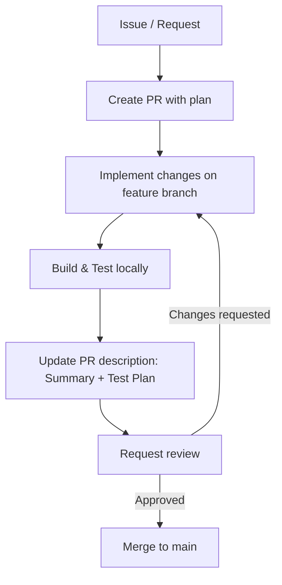

# Copilot Coding Agent Instructions

Purpose
Guide Copilot to make focused, high-quality changes to this repository with minimal back-and-forth.

Repository context
- WebClientCore is a Blazor Server app that renders a live view of agents and cities.
- State records live under src/WebClientCore/State.
- In-memory registry and related services live under src/WebClientCore/Services.
- Default branch: main. Prefer PRs to main with a short, descriptive title.

General guidelines
- Do not remove or rename existing files unless required to fix a bug or complete a task.
- Keep changes minimal and cohesive; avoid scope creep.
- Ensure the solution builds (dotnet build) after changes.
- Add or update tests when applicable (or include a manual test plan in the PR).

Coding conventions
- Target .NET 8, nullable reference types enabled.
- Prefer records for immutable state types.
- Thread-safety: guard mutable shared state with locks or channels.
- Blazor: use DI via @inject / constructor injection; call InvokeAsync(StateHasChanged) from background events.

Pull requests
- Always create a branch and open a PR; do not push directly to main.
- Include:
  - Summary of changes
  - Acceptance criteria addressed
  - Test plan with steps to validate
  - Any config or migrations required
- Mark large or multi-step tasks as [WIP] and convert to “Ready for review” when complete.

Common tasks
- State/model additions: place records in src/WebClientCore/State and keep them immutable.
- Services: place interfaces and implementations in src/WebClientCore/Services; register in Program.cs with DI.
- UI changes: keep minimal and accessible tables/lists; prefer server-side rendering without JS unless needed.

Mermaid: contribution workflow

Acceptance checklist for PRs
- [ ] Builds successfully (dotnet build)
- [ ] No breaking changes to public APIs unless documented
- [ ] UI compiles and loads; basic smoke test performed
- [ ] PR description includes a test plan
- [ ] Code is small, focused, and well-scoped

Knowledge for this repo
- ResourceRegistry exposes:
  - UpsertAgent(agentId, name, lastSeen)
  - UpsertResources(agentId, IEnumerable<(CityId, Name)>)
  - ApplyWeatherUpdate(cityId, agentId, temperatureC, timestamp)
  - Changed event and GetSnapshot()

When adding SignalR integration
- Place hubs under a Hubs folder
- Map hub routes in Program.cs (app.MapHub<THub>("/hubRoute"))
- Add a scoped service to translate hub messages into registry operations.