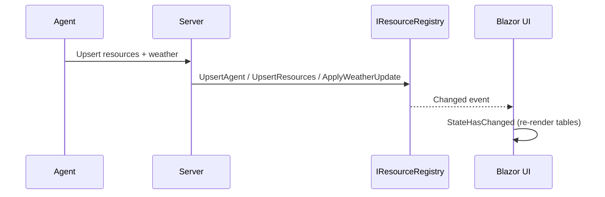
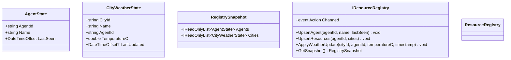

# Blazor Agent Core SignalR

A sample showcasing an agent-driven resource registry surfaced in a Blazor Server app, with live updates via SignalR. The Web client maintains a simple in-memory registry of Agents and the Cities they report, including last-seen timestamps and latest weather readings.

Features
- Blazor Server UI listing Agents and Cities with live updates
- In-memory registry with change notifications
- Simple state records: Agent, City weather, and a registry snapshot
- SignalR-ready design to integrate with real-time agent updates

Project layout
- src/WebClientCore: Blazor Server app that renders Agents and Cities
- src/WebClientCore/Services: In-memory IResourceRegistry and implementation
- src/WebClientCore/State: Records for AgentState, CityWeatherState, RegistrySnapshot

Architecture overview

```mermaid
graph TD
    A[Agents] -- SignalR / HTTP --> B[Server Endpoints]
    B --> C[IResourceRegistry (in-memory)]
    C --> D[Blazor Components]
    D --> E[UI: Agents & Cities Tables]

    subgraph WebClientCore
      C
      D
      E
    end
```

Update flow (conceptual)



State model



Getting started

Prerequisites
- .NET SDK 8.0 or later
- Node.js (optional) if you add tooling that requires it

Build and run
- Clone the repository
- Open the solution in Visual Studio / Rider or run from the CLI
- From the repository root:
  - dotnet build
  - dotnet run --project src/WebClientCore/WebClientCore.csproj
- Navigate to http://localhost:5000 or the URL shown in the console to see the Agents and Cities tables

Seeding sample data (optional)
If you don't yet have agents sending updates, you can seed a few rows during startup to visualize the UI.

Add this snippet in src/WebClientCore/Program.cs after the app is built (var app = builder.Build();) and before app.Run():

```csharp
using (var scope = app.Services.CreateScope())
{
    var registry = scope.ServiceProvider.GetRequiredService```

How it works
- The ResourceRegistry keeps in-memory dictionaries for Agents and Cities and exposes a Changed event.
- Blazor components (e.g., Pages/Index.razor) subscribe to Changed and call GetSnapshot() to re-render.
- You can wire SignalR handlers to call UpsertAgent, UpsertResources, and ApplyWeatherUpdate when messages arrive.

Extending the sample
- Add a SignalR Hub and client to push real-time updates from agents
- Persist registry state (e.g., Entity Framework Core, Redis)
- Add paging, filtering, and sorting for large registries
- Expose minimal APIs for testing and automation

Contributing
- Fork, create a feature branch, and open a PR
- Include a short description, screenshots (optional), and a test plan
- Keep the solution building on .NET 8
- Prefer small, incremental PRs

License
Specify your preferred license (e.g., MIT) in a LICENSE file.
